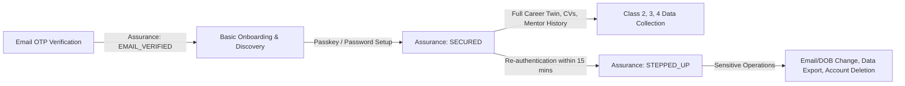

# CareerOS Progressive Identity & Security Architecture

This document defines the sovereign identity, progressive authentication, data classification, and authorization architecture for Career OS engineers and system administrators.

---

## 1. Identity Model

Career OS decouples application-level person records from authentication provider credentials:

- **`public.profiles`**: Represents the canonical application person record. Contains user display metadata, date of birth, age policy state, consent state, security assurance level, and lifecycle status.
- **`public.identities`**: Auth provider credentials (e.g. Email OTP, Passkey, Google OAuth, Microsoft SSO) linked to a `profile_id`.
- **`public.user_passkeys`**: Registered W3C WebAuthn credentials (public keys, credential IDs, device names, counter) linked to a `profile_id`.
- **`public.user_active_sessions`**: Active device session registry with hash-based tokens, device categories, and revocation timestamps.
- **`public.user_security_events`**: Append-only security audit log recording significant lifecycle and authentication events (`account_created`, `email_verified`, `passkey_registered`, `password_set`, `login_success`, `session_revoked`, `step_up_success`).

---

## 2. Authentication Assurance Levels

Career OS implements progressive authentication to avoid upfront registration friction while securing personal career assets:



### Assurance Levels:
1. **`EMAIL_VERIFIED`**:
   - Initial state established upon verifying the 6-digit email OTP.
   - Authorizes access to **Class 0 (Public)** and **Class 1 (Basic)** data (e.g. name, broad career stage, high-level preferences).
   - Prohibits storage or processing of sensitive personal career data.
2. **`SECURED`**:
   - Established once the user configures a biometric passkey (Touch ID, Face ID, Windows Hello) or a strong password.
   - Authorizes access to **Class 2 (Personal Career)**, **Class 3 (Sensitive CareerOS)**, and **Class 4 (Rich Media)**.
3. **`STEPPED_UP`**:
   - Established when a user re-authenticates with passkey or password within a 15-minute window (`STEP_UP_MAX_AGE_MS = 15 * 60 * 1000`).
   - Required for sensitive account mutations (changing email/DOB, removing passkeys, exporting personal data, account deletion).

---

## 3. Data Classification Framework

| Data Class | Name | Examples | Required Assurance | Explicit Consent |
| :--- | :--- | :--- | :--- | :--- |
| **CLASS 0** | Public / Anonymous | Public career guides, pathways, events directory, public documentation | `EMAIL_VERIFIED` | No |
| **CLASS 1** | Basic Account | Email address, display name, broad career stage, broad interests | `EMAIL_VERIFIED` | Yes (Terms & Privacy) |
| **CLASS 2** | Personal Career Data | CV/resume uploads, employment history, detailed education, applications | `SECURED` | Yes |
| **CLASS 3** | Sensitive Career Intelligence | Private AI mentor conversations, diagnostic assessments, salary expectations | `SECURED` | Yes |
| **CLASS 4** | High-Sensitivity Media | Mock interview video feeds, voice recordings, interview transcripts | `SECURED` | Yes (Feature-specific) |

---

## 4. Youth Account & Minor Safeguarding Architecture

Career OS serves students, young adults, and working professionals with canonical age-policy branching:

### Age Brackets:
1. **Under 13 (`UNDER_13`)**:
   - Direct consumer signup is **hard-blocked** under COPPA.
   - No normal profile is persisted.
   - Permitted exclusively through verified educational institution arrangements operating under FERPA's school official exception.
2. **Ages 13–15 (`MINOR_13_17` + `requiresGuardianConsent = true`)**:
   - Requires verified parent/guardian email or verified school arrangement.
   - Profile initialized with `status = 'PENDING_GUARDIAN_CONSENT'` and `consent_state = 'PENDING'`.
   - Stalled unverified accounts are purged after 30 days via `purge_stalled_pending_accounts()`.
3. **Ages 16–17 (`MINOR_13_17` + `hasDirectAccountEligibility = true`)**:
   - Eligible for direct individual accounts without parental sponsorship under Career OS product policy.
   - Minor safeguarding controls active by default: profile default-private, employer direct contact hard-blocked, employer discovery disabled until verified match.
4. **Age 18+ (`ADULT_18_PLUS`)**:
   - Standard adult direct account policy with self-sovereignty.

### Youth Privacy Defaults:
- Profile visibility is `PRIVATE` by default.
- No public directory listing or search engine indexing.
- Zero third-party advertising tracking.
- Employer interactions require candidate-initiated consent grants.

---

## 5. Centralized Security Gate & Authorization

Access to sensitive data is evaluated server-side using `evaluateSecurityGate` and `enforceSecurityGate`:

```ts
import { enforceSecurityGate } from '@/lib/auth/assurance';

export async function POST(request: NextRequest) {
  // Enforces authenticated user + SECURED assurance + age compliance
  const profile = await enforceSecurityGate('CLASS_2_PERSONAL_CAREER');
  
  // Proceed with privileged personal data processing...
}
```

The authorization decision evaluates:
$$\text{Access} = \text{Auth Identity} \land \text{Security Assurance} \land \text{Resource Ownership} \land \text{Age Policy} \land \text{Consent}$$

---

## 6. Row Level Security (RLS) & Database Permissions

Row Level Security is enabled on all tables. Helper functions enforce ownership without relying on client-supplied parameters:

- `public.auth_profile_id()`: Returns `public.profiles.id` matching `auth.uid()`.
- `public.auth_security_assurance()`: Returns the profile's current assurance level.
- `public.is_account_secured()`: Verifies if `security_assurance IN ('SECURED', 'STEPPED_UP')`.
- `public.is_session_stepped_up()`: Verifies if `last_stepped_up_at > now() - interval '15 minutes'`.

### Table RLS Policies:
- `profiles`: Select and update restricted to profile owner (`id = auth_profile_id()`).
- `user_passkeys`: Select, insert, update, delete restricted to passkey owner.
- `user_active_sessions`: Select and update restricted to session owner.
- `user_security_events`: Select restricted to profile owner; immutable append-only.
- `consents` & `policy_acceptances`: Select and insert restricted to subject profile.

---

## 7. Account Recovery & Session Revocation

- **Multi-Passkey Support**: Users can enroll multiple passkeys (MacBook Touch ID, iPhone, Windows Hello) with custom device names.
- **Recovery Guardrail**: Users cannot remove their final passkey without having an alternative active password/recovery method configured.
- **Session Revocation**: Users can view all active sessions and invoke "Log out other devices" from `/app/settings/security`.
- **Password Reset**: Initiated exclusively through limited-duration email challenges with token rotation.

---

## 8. Separation of Privileged Admin Domain

Administrative access to Career OS is strictly separated from consumer user authentication:
- Normal user authentication resides at `/login`, `/signup`, and `/api/auth/*`.
- Administrative authentication resides at `/admin/login` and `/api/admin/auth/*` using dedicated cryptographically signed admin session cookies (`ADMIN_SESSION_COOKIE_NAME`).
- Platform administrators never have master passwords, cannot view raw user passwords, and cannot bypass user security gates. Privileged staff actions on user data are logged to `public.audit_events`.
